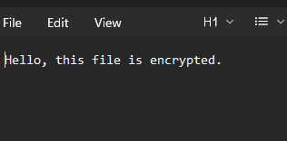

# 🖼️ LSB Steganography in C

> Hide secret files inside BMP images using Least Significant Bit encoding.

---

## 📌 Overview

This project implements **LSB (Least Significant Bit) Steganography** in C to hide and retrieve data inside a BMP image. It supports embedding and extracting multiple file types — text, PDF, MP3, and BMP — through a simple menu-driven interface.

---

## ✨ Features

- 🔐 **Encrypt** any supported file into a BMP image
- 🔓 **Decrypt** hidden files from an encoded image
- 📂 **Supports** `.txt`, `.pdf`, `.mp3`, and `.bmp` file types
- 🧠 **Menu-driven interface** — no flags or arguments needed
- ⚡ **Efficient** bit-level encoding using the LSB technique

---

## 📂 Project Structure

```
lsb-steganography/
├── src/
│   ├── main.c        # Entry point & menu logic
│   ├── function.c    # Encode/decode implementation
│   └── header.h      # Function declarations & constants
├── images/
│   ├── encrypt.png   # Encryption demo screenshot
│   └── decrypt.png   # Decryption demo screenshot
├── README.md
└── .gitignore
```

---

## ⚙️ How It Works

### 🔐 Encryption

1. Reads the secret input file into memory
2. Converts file data to binary (bit by bit)
3. Embeds each bit into the **least significant bit** of individual bytes in the BMP pixel data
4. Writes a new encoded BMP image to disk — visually identical to the original

### 🔓 Decryption

1. Reads the encoded BMP image
2. Extracts the LSBs from the pixel data in order
3. Reconstructs the original file from the recovered bits
4. Saves the output file with its original extension

---

## 🛠️ Build & Run

### Prerequisites

- GCC (or any C compiler)
- A Linux/macOS terminal (or MinGW on Windows)

### Compile

```bash
gcc main.c function.c  -o stego
```

### Run

```bash
./stego
```

### Menu Options

```
1 → Encrypt a file into a BMP image
2 → Decrypt a file from an encoded image
3 → Quit
```

---

## 📸 Demo

### 🔐 Encryption


### 🔓 Decryption



---

## 📁 Supported File Types

| Type  | Extension | Notes                     |
|-------|-----------|---------------------------|
| Text  | `.txt`    | ASCII and UTF-8 supported |
| PDF   | `.pdf`    | Binary-safe encoding      |
| Audio | `.mp3`    | Binary-safe encoding      |
| Image | `.bmp`    | Nested BMP support        |

---

## 🛠️ Technologies Used

| Area               | Details                    |
|--------------------|----------------------------|
| Language           | C (C99 standard)           |
| File I/O           | Standard `<stdio.h>` APIs  |
| Bit Manipulation   | Bitwise operators (`&`, `|`, `>>`, `<<`) |
| Image Format       | BMP (uncompressed, 24-bit) |

---

## 🎯 Learning Outcomes

- Bit-level data manipulation in C
- Reading and writing binary files
- Understanding the BMP image format
- Implementing real-world encoding and decoding logic

---

## 🔮 Future Improvements

- [ ] Support PNG and JPEG image formats
- [ ] Optimize for large files using buffered I/O

---

## 👩‍💻 Author

**Swati Pathak**

---

> ⭐ Found this project interesting? Feel free to explore the code and share your feedback!
